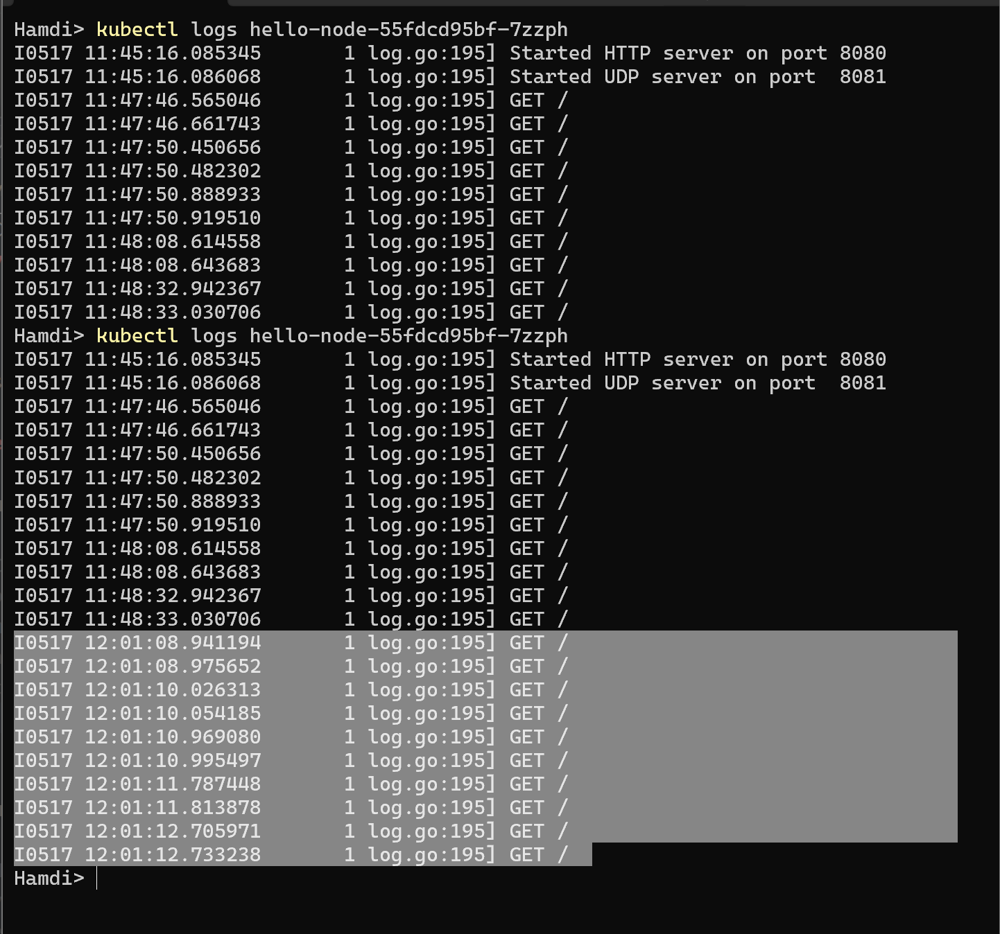

# advpro-module-11

Nama : Ilham Abdillah Alhamdi  
NPM : 2206081194  
Kelas : Advance Programming A  

## Reflection on Hello Minikube

1. Question 1

  > Compare the application logs before and after you exposed it as a Service. Try to open the app several times while the proxy into the Service is running. What do you see in the logs? Does the number of logs increase each time you open the app?

  Pada hasil logs yang diperoleh dari command `kubectl logs <PODS_NAME>`, terlihat informasi mengenai dijalankannya service HTTP dan UDP di awal, serta beberapa log terkait HTTP request yang mengakses aplikasi. 

  

  Gambar di atas adalah snapshot dari logs pada pod di waktu yang berbeda. Log pertama pertama adalah initial condition. Sedangkan log kedua adalah kondisi setelah dilakukan 5 kali hit/akses aplikasi. Terlihat terdapat perbedaan jumlah record log untuk HTTP request GET, sebanyak 10 record. 

2. Question 2

  > Notice that there are two versions of `kubectl get` invocation during this tutorial section. The first does not have any option, while the latter has `-n` option with value set to `kube-system`. What is the purpose of the `-n` option and why did the output not list the pods/services that you explicitly created?

  Opsi `-n` pada perintah `kubectl get` digunakan untuk menentukan _namespace_ untuk mencari _resource_.

  Di Kubernetes, _namespace_ adalah cara untuk membagi resource kluster antara beberapa pengguna atau tim. _Namespace_ ini pada dasarnya adalah _scoope_ untuk resource dan bisa digunakan untuk memberikan cakupan pada beberapa nama. Ini adalah cara untuk membagi resource kluster antara berbagai penggunaan.

  `kubectl get services`:  
  Perintah ini tanpa opsi -n akan menampilkan daftar layanan di _namespace_ default.

  `kubectl get pods,services -n kube-system`: 
   Perintah ini dengan opsi `-n kube-system` akan menampilkan daftar pod dan layanan di namespace `kube-system`. Namespace `kube-system` adalah namespace khusus yang dicadangkan untuk pod sistem yang menjalankan Kubernetes itu sendiri. Pada tutorial ini, perintah ini digunakan untuk memverifikasi apakah `service/metrics-server` telah dijalankan atau tidak (yang mana terdapat pada namespace `kube-system`).

   